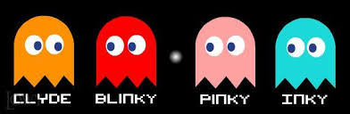

# * Pacman game with path-finding algorithm intergration for the ghost

- Main file to run is run.py
- Algorithm file is in ghost.py
- A* for Blinky and Inky
- BFS for Clyde
- DFS for Pinky

 
 - Press enter to get into the game
 - Press space to play normal mode
 - Press s to start game using algorithm
 - Press a to run ghost by a*
 - Press d to run ghost by dfs
 - Press b to run ghost by bfs